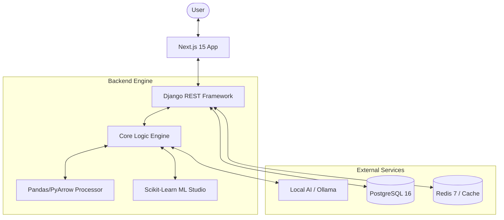

# 📘 PyAnalypt Developer Guidebook

Welcome to the **PyAnalypt** development ecosystem. This document serves as the primary source of truth for architects, developers, and contributors building the next generation of "No-Code" data science.

---

## 🚀 Project Overview

### What is PyAnalypt?
PyAnalypt is an AI-first, web-based data science platform designed to democratize data cleaning and analysis. It bridges the gap between raw, messy data and actionable insights by providing a code-free interface for complex Python-based data operations.

### Why PyAnalypt? (The "Why")
Traditional data science tools (Jupyter, Pandas, SQL) have a steep learning curve. This creates a "data silo" where business users depend on developers for even simple data cleaning tasks. PyAnalypt was created to **tear down this wall**, empowering non-technical stakeholders to handle their own data lifecycle securely and efficiently.

### Our Mission
To provide a private, local-first (via Ollama) and intuitive environment where data cleaning feels like a conversation, not a programming chore.

### Core Design Philosophy
1.  **Zero-Code Interaction**: Every transformation must be possible via a UI click.
2.  **Local-First AI**: User data should stay on their infrastructure; hence our reliance on local LLMs (Ollama).
3.  **Auditability**: Every change must be logged and reversible (The Mutation Pattern).
4.  **Extensibility**: The engine must be modular, allowing developers to add new cleaning tools without touching the UI core.

---

## 🏗️ System Architecture

PyAnalypt is built on a decoupled architecture, separating the heavy data-processing engine from the interactive user interface.

### 🗺️ High-Level Map



---

## 🧠 The Backend Ecosystem (`/apps`)

The backend is modularized into specialized Django applications, each handling a specific domain of the data lifecycle.

### 1. `apps.core` (The Brain)
The heart of the application. It doesn't store state; it processes data.
- **`data_engine.py`**: A wrapper around Pandas that executes cleaning, filtering, and transformation operations.
- **`ollama_client.py`**: Handles communication with the local Ollama instance for AI-powered diagnostics.
- **`chart_engine.py`**: Generates JSON-based chart specifications for the frontend.
- **`ml_engine.py`**: Manages machine learning workflows (clustering, regression, etc.).

### 2. `apps.datasets`
Handles the ingestion and management of raw data files.
- **Storage**: Files are stored in `media/datasets/`.
- **Formats**: Supports CSV, XLSX, JSON, and Parquet.
- **Metadata**: Tracks column types, row counts, and memory usage.

### 3. `apps.datalab`
The primary workspace for interactive data cleaning.
- **Operations**: Implements the logic for "filling NAs", "dropping duplicates", "type casting", etc.
- **History**: Tracks the sequence of operations applied to a dataset using `DatasetActivityLog`.

### 4. `apps.dashboards`
Manages user-customized visualization boards.
- **Widgets**: Support for Charts, freeform Text, and **Embedded Reports**.
- **Sharing**: Dashboards can be made public via a unique `share_token` for external viewing.
- **Layout**: Uses a 12-column grid system for drag-and-drop customization.

### 5. `apps.visualization`
Powers the "Inspect" and "Dashboard" features.
- High-performance aggregation logic to provide summary statistics and distribution data.

### 5. `apps.users`
Extends Django's `AbstractUser`.
- **Auth**: JWT-based authentication via `dj-rest-auth` and `SimpleJWT`.
- **Social**: Integrated Google OAuth 2.0 flow.

---

## 🎨 Frontend Architecture (`/pyanalypt_frontend`)

Built with **Next.js 15 (App Router)** and **Tailwind CSS**.

### Key Components
- **`src/services/api-client.ts`**: The centralized Axios instance with interceptors for JWT injection and token refreshing.
- **`src/hooks/`**: Custom hooks like `useVisualization` and `useDataset` to abstract complex API interactions.
- **`src/components/`**: Atomic design structure:
    - `ui/`: Shadcn/UI primitives.
    - `datalab/`: Specific components for the cleaning interface.
    - `charts/`: Reusable Recharts/Chart.js wrappers.

### State Management
- **Local State**: React `useState` and `useReducer` for form logic.
- **Global State**: Managed via Context Providers (`src/context/`) for Auth and UI settings.

---

## 🔄 Core Workflows

### 📥 The Dataset Lifecycle
1.  **Upload**: `POST /api/v1/datasets/` - File is saved and basic metadata is extracted.
2.  **Diagnostic**: `POST /api/v1/datasets/{id}/analyze_issues/` - `DataEngine` finds anomalies, `OllamaClient` generates plain-English goals.
3.  **Transformation**: `POST /api/v1/datalab/clean/` - Specific cleaning operations are applied.
4.  **Export**: `GET /api/v1/datasets/{id}/export/` - The processed DataFrame is converted back to the requested file format.

### 🔐 Authentication & Sharing
- **Auth Flow**: Frontend sends credentials to `/api/auth/login/`, receives JWT tokens.
- **Public Sharing**: Dashboards can bypass authentication via the `share_token` system.
- **Access**: `GET /api/v1/dashboards/public/{share_token}/` provides read-only access to authorized public content.

---

## 🛠️ Developer Onboarding & Setup

Setting up PyAnalypt for development requires configuring both the Django backend and the Next.js frontend.

### 1. Backend Environment (Django)
The backend handles data processing, file management, and the AI bridge.

**Prerequisites**:
- Python 3.11+
- PostgreSQL 16
- Redis 7 (for caching)
- Ollama (for AI features)

**Setup Steps**:
1.  **Virtual Env**: `python -m venv venv` and activate it.
2.  **Dependencies**: `pip install -r requirements.txt`.
3.  **Database**: Create a database named `pyanalyptdb` in Postgres.
4.  **Env Config**: Create a `.env` file from `.env.example`.
5.  **Migrations**: `python manage.py migrate`.
6.  **Admin User**: `python manage.py createsuperuser`.
7.  **Run**: `python manage.py runserver`.

### 2. Frontend Environment (Next.js)
The frontend provides the interactive DataLab and Visualization dashboard.

**Setup Steps**:
1.  **Navigate**: Go to the `/pyanalypt_frontend` directory.
2.  **Dependencies**: `npm install`.
3.  **Env Config**: Create `.env.local` pointing `NEXT_PUBLIC_API_URL` to your Django server.
4.  **Run**: `npm run dev`.

### 3. AI Integration (Ollama)
PyAnalypt uses Ollama to run local models for data diagnostics.
1.  **Install**: Download Ollama from [ollama.com](https://ollama.com/).
2.  **Pull Model**: `ollama pull qwen2.5:7b` (or your preferred model).
3.  **Start**: Ensure the daemon is running (`ollama serve`).

---

## 🐳 Docker Deployment (Fast Track)

For developers who want to skip the manual environment setup, we provide pre-built Docker images for both the backend and frontend.

### 1. Pull the Images
```bash
# Backend (Django)
docker pull limkhysok/pyanalypt:latest

# Frontend (Next.js)
docker pull limkhysok/pyanalypt-frontend:latest
```

### 2. Docker Repositories
- **Backend**: [limkhysok/pyanalypt](https://hub.docker.com/repository/docker/limkhysok/pyanalypt/general)
- **Frontend**: [limkhysok/pyanalypt-frontend](https://hub.docker.com/repository/docker/limkhysok/pyanalypt-frontend/general)

### 3. Simplified Launch
Create a `docker-compose.yml` in your root and run `docker compose up -d`. This will orchestrate the Backend, Frontend, PostgreSQL, and Redis automatically.

---

## 🧪 Developer Usage & Testing

Once set up, follow this workflow to verify the system is functional:

1.  **Ingestion**: Use the Django Admin or `POST /api/v1/datasets/` to upload a sample CSV.
2.  **Health Check**: Call `GET /api/v1/datalab/inspect/{id}/` to verify the `DataEngine` is reading the file correctly.
3.  **AI Diagnostic**: Call `POST /api/v1/datasets/{id}/analyze_issues/`. Check your `ollama serve` terminal to see the model processing the request.
4.  **Cleaning Test**: Use the `POST /api/v1/datalab/clean/` endpoint (or the frontend UI) to perform a "Drop Nulls" or "Rename Column" action.
5.  **Verify History**: Check the `DatasetActivityLog` in the admin panel to ensure the mutation was logged and a snapshot was created.

---

### 📝 Adding New Features
- **Backend**:
    1. Define the logic in the appropriate `apps/<app>/services.py` or `core/`.
    2. Create serializers in `serializers.py`.
    3. Implement the ViewSet in `views.py`.
    4. Update `API_DOC_S.md` with the new endpoint.
- **Frontend**:
    1. Define the TypeScript types in `src/types/`.
    2. Add the API method to `src/services/`.
    3. Build the UI component and hook it up.

### 🧪 Testing
- **Backend**: Run `pytest` or `python manage.py test`.
- **Frontend**: Use `npm run lint` and `npm run dev` to catch issues early.

---

## 🛠️ Core Implementation Patterns

To maintain consistency across the platform, developers should follow these established patterns.

### 1. The Backend Mutation Pattern
All data-altering operations in `DatalabViewSet` (and similar views) follow a strict 3-step lifecycle:
1.  **`_load_and_lock`**: Acquires a row-level DB lock on the `Dataset` and loads the DataFrame (from cache or disk).
2.  **Apply Logic**: Executes the transformation using `DataEngine` utilities.
3.  **`_commit_mutation`**: 
    - Saves the new DF to disk.
    - Creates a **Snapshot** (for Undo/Revert).
    - Invalidates/Pre-warms the cache.
    - Logs the activity.

> [!IMPORTANT]
> Always wrap mutations in `transaction.atomic()` to prevent partial state updates.

### 2. Snapshots & Safety Net
Every time a user cleans data, PyAnalypt creates a `DatasetSnapshot`. 
- **Undo**: Restores the immediate previous snapshot.
- **Revert**: Restores a specific point in time from the `DatasetActivityLog`.

### 3. Frontend Service Layer
Avoid calling `fetch` or `axios` directly in components.
- Use `src/services/` (e.g., `datalab.service.ts`) for all API definitions.
- Use `src/hooks/` to manage the lifecycle of that data (loading, error, success states).

---

## 🚀 Recent Architectural Improvements

- **Cloudflare Tunnels**: Support for remote development access via `cloudflared`, allowing secure external testing of the local stack.
- **Streamed AI Suggestions**: `OllamaClient` now supports streaming for real-time cleaning goal generation.
- **Categorical Handling**: Enhanced support for non-numeric columns in cleaning tools (mode-based filling, deduplication).
- **Responsive Layouts**: Implementation of `svh` (small viewport height) and dynamic grid breakpoints for mobile-first data management.

---

## 📁 Repository Standards
- **Git Hooks**: (Recommended) Use Husky to run linting before commits.
- **Branching**: `feat/` for new features, `fix/` for bugs, `docs/` for documentation.
- **Commits**: Follow [Conventional Commits](https://www.conventionalcommits.org/).

---

> *PyAnalypt: Turning messy data into clarity, one developer at a time.*
